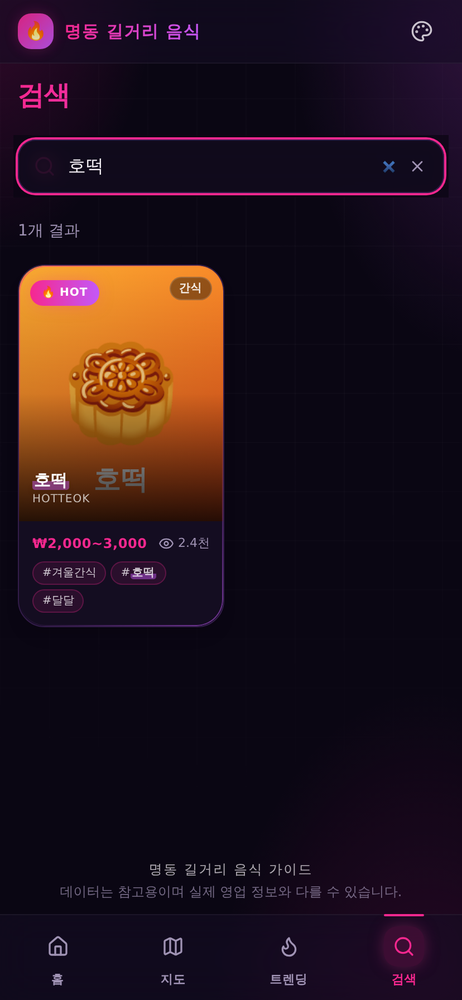
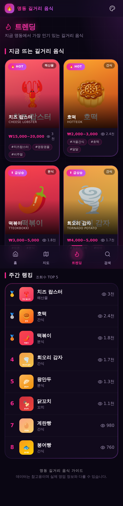
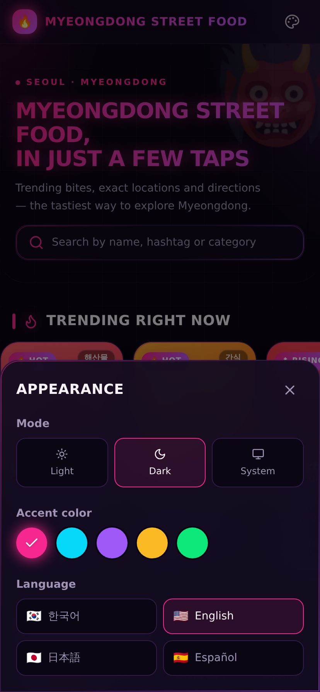

# 명동 길거리 음식 가이드 (Myeongdong Street Food Guide)

명동의 인기 길거리 음식을 지도와 함께 한눈에 볼 수 있는 모바일 우선 웹
서비스입니다. **사이버펑크 × K-데몬 헌터스** 무드의 네온/글래스 디자인으로,
트렌딩/랭킹, 검색·정렬, Google 지도, 길찾기, 다국어(i18n), 네온 테마 색상/다크
모드, 관리자 CRUD를 제공합니다.

## 스크린샷

> 데모 모드(`NEXT_PUBLIC_DEMO_MODE=1`)로 렌더링한 모바일 화면입니다. 기본 테마는
> 다크 + 데몬 마젠타이며, 지도는 Google Maps API 키 설정 시 표시됩니다.

| 홈 (다크·데몬 마젠타) | 검색 (네온 하이라이트) | 트렌딩 |
| :---: | :---: | :---: |
|  |  |  |

| 음식 상세 | 화면 설정 (네온 테마·언어) | 테마 전환 (사이버 시안) |
| :---: | :---: | :---: |
|  |  |  |

## 기술 스택

- **Next.js 14** (App Router) + **TypeScript**
- **Tailwind CSS** + **shadcn/ui** + **framer-motion** (네온 글로우·마이크로 인터랙션)
- 디스플레이 폰트 **Orbitron** (라틴) / **Black Han Sans** (한글) — 런타임 로드
- **Supabase** (Postgres + Auth + Storage)
- **Google Maps** (`@react-google-maps/api`)
- **next-intl** (ko / en / ja / es 다국어)
- **Vitest** (unit) + **Playwright** (e2e)
- 배포: **Vercel**

## 주요 기능

- 🎨 **네온 테마 색상 피커** — 5가지 프리셋(데몬 마젠타 · 사이버 시안 · 소울 퍼플 ·
  골드 부적 · 톡식 그린) + 라이트/다크/시스템 모드(기본 다크). `localStorage` 저장,
  CSS 변수로 글로우까지 부드럽게 전환. 헤더의 팔레트 아이콘에서 **화면 설정** 시트.
- 🌏 **다국어(i18n)** — 한국어·영어·일본어·스페인어 4개 로케일. 모든 UI 문구를
  `messages/*.json` 으로 외부화, 브라우저 언어 자동 감지(기본 ko), 설정에서 전환.
- 🔍 **검색** — 이름·해시태그·카테고리 즉시 검색(디바운스), 매칭어 하이라이트,
  깔끔한 빈 상태.
- 🗺 **Google 지도** — 다중 마커(홈/지도) · 단일 마커(상세), 마커 클릭 시 상세
  이동, **길찾기** Google Maps 딥링크.
- 📱 **모바일 하단 내비게이션** — 홈 / 지도 / 트렌딩 / 검색.
- 🔥 트렌딩(HOT/급상승 배지) + 주간 랭킹(조회수 TOP), 인기순/최신순 정렬.
- 상세 페이지 방문 시 조회수 증가(API Route → SQL 함수), 유튜브 쇼츠 **외부 링크**.
- 관리자: 이메일/비밀번호 로그인, 음식 CRUD(서버 액션, 다국어 필드 포함),
  썸네일 Storage 업로드, 급상승 토글.

## 프로젝트 구조

```
app/
  (public)/            # 공개 페이지 (헤더 + 하단 내비)
    page.tsx           # 홈
    search/            # 검색
    trending/          # 트렌딩 + 랭킹
    map/               # 전체 지도
    food/[id]/         # 음식 상세
  (admin)/admin/       # 관리자 (미들웨어로 보호)
  api/foods/[id]/view  # 조회수 증가 API
components/
  theme/               # ThemeProvider / 프리셋 / no-FOUC 스크립트
  GoogleMap.tsx        # 재사용 지도 컴포넌트
  AppearanceSheet.tsx  # 화면 설정 바텀시트 (테마·언어)
  BottomNav.tsx, SiteHeader.tsx, FoodCard.tsx, SearchView.tsx ...
i18n/                  # next-intl 설정 (config / request / locale 액션)
messages/              # en.json / ja.json / ko.json / es.json
lib/                   # 타입, 정렬·검색 유틸, 지도 유틸, i18n-food 헬퍼, 쿼리
supabase/migrations/   # 0001_init.sql, 0002_i18n.sql
supabase/seed.sql      # 다국어 시드 8종
tests/                 # vitest(unit) / playwright(e2e)
```

## 1. 사전 준비

- Node.js 20+
- [Supabase](https://supabase.com) 프로젝트
- [Google Cloud Console](https://console.cloud.google.com) — Maps JavaScript API 키

## 2. 환경 변수

`.env.local.example` 를 복사해 `.env.local` 을 만들고 값을 채웁니다.

```bash
cp .env.local.example .env.local
```

| 변수 | 설명 |
| --- | --- |
| `NEXT_PUBLIC_SUPABASE_URL` | Supabase 프로젝트 URL |
| `NEXT_PUBLIC_SUPABASE_ANON_KEY` | Supabase anon public 키 |
| `SUPABASE_SERVICE_ROLE_KEY` | 서버 전용 service role 키 (브라우저 노출 금지) |
| `NEXT_PUBLIC_GOOGLE_MAPS_API_KEY` | Google Maps JavaScript API 키 |
| `NEXT_PUBLIC_SUPABASE_STORAGE_BUCKET` | 썸네일 버킷명 (기본 `food-thumbnails`) |
| `NEXT_PUBLIC_DEMO_MODE` | (선택) `1` 이면 Supabase 미설정 시 샘플 데이터 표시 |

Google Maps 키는 **APIs & Services → Credentials** 에서 발급하고 **Maps
JavaScript API** 를 활성화합니다. 키는 사용 도메인(예: `localhost:3000`,
배포 도메인)으로 제한하는 것을 권장합니다.

## 3. 데이터베이스 마이그레이션 & 시드

### 방법 A — Supabase SQL Editor (가장 간단)

1. Supabase 대시보드 → **SQL Editor**
2. `supabase/migrations/0001_init.sql` 실행
3. `supabase/migrations/0002_i18n.sql` 실행
4. `supabase/seed.sql` 실행

### 방법 B — Supabase CLI

```bash
npm i -g supabase
supabase link --project-ref <your-project-ref>
supabase db push                               # 모든 마이그레이션 적용
supabase db execute --file supabase/seed.sql   # 시드
```

마이그레이션은 다음을 생성/변경합니다:

- `foods` 테이블 + 인덱스, RLS(누구나 SELECT, 인증 사용자만 쓰기)
- `increment_view_count(food_id uuid)` 함수, `food-thumbnails` Storage 버킷
- (0002) i18n 컬럼: `name_ja`, `name_es`, `translations jsonb`

## 4. 다국어(i18n) 동작 방식

- **UI 문구**: `messages/{ko,en,ja,es}.json` 에 모두 외부화. next-intl 의 쿠키
  기반(URL 비변경) 방식으로, 첫 방문 시 `Accept-Language` 로 자동 감지하고
  이후에는 설정에서 고른 언어를 `NEXT_LOCALE` 쿠키에 저장합니다. 기본은 `ko`.
- **음식 데이터**:
  - 이름은 전용 컬럼 `name_ko / name_en / name_ja / name_es` 사용.
  - 설명은 `translations` **JSONB** 컬럼에 로케일별로 저장
    (`{ "en": "...", "ja": "...", "es": "..." }`). 기본 `description` 컬럼은
    한국어 텍스트입니다.
  - 누락 시 영어 → 한국어 순으로 자동 폴백하여 빈 값이 노출되지 않습니다
    (`lib/i18n-food.ts`).

## 5. 테마 시스템

- 액센트 프리셋과 라이트/다크/시스템 모드는 `localStorage`(`md.accent`,
  `md.mode`)에 저장되고 `<html>` 의 `data-accent` 속성과 `.dark` 클래스로
  적용됩니다. 색상은 모두 CSS 변수(`app/globals.css`)로 정의되어 전환이
  부드럽습니다. `<head>` 의 인라인 스크립트가 첫 페인트 전에 적용해 FOUC 를
  방지합니다.

## 6. 관리자 계정 생성

Supabase 대시보드 → **Authentication → Users → Add user** 로 이메일/비밀번호
사용자를 만든 뒤 `/admin/login` 에 로그인합니다. (운영자 백오피스 UI 문구는
한국어로 고정되어 있습니다.)

## 7. 로컬 개발 & 스크립트

```bash
npm install
npm run dev        # 개발 서버 (http://localhost:3000)

npm run build      # 프로덕션 빌드
npm run start      # 프로덕션 서버
npm run lint       # ESLint
npm run typecheck  # tsc --noEmit
npm run test       # Vitest (단위 테스트)
npm run test:e2e   # Playwright (e2e, 빌드 후 자동 서버 기동)
```

> 빌드/단위 테스트/린트는 실제 Supabase·Google 키 없이도 통과하도록 설계되어
> 있습니다(키가 없으면 데이터는 빈 목록, 지도는 안내 플레이스홀더로 폴백).
> `NEXT_PUBLIC_DEMO_MODE=1` 로 빌드/실행하면 내장 샘플 데이터로 미리볼 수
> 있습니다.

## 8. CI

`.github/workflows/ci.yml` 가 push/PR 마다 lint → typecheck → vitest →
playwright 를 실행합니다. 비밀 값이 없으면 placeholder 환경 변수로
빌드/실행합니다. 실제 값을 쓰려면 리포지토리 **Settings → Secrets** 에
`NEXT_PUBLIC_SUPABASE_URL`, `NEXT_PUBLIC_SUPABASE_ANON_KEY`,
`NEXT_PUBLIC_GOOGLE_MAPS_API_KEY` 를 등록하세요.

## 9. Vercel 배포

1. GitHub 리포지토리를 Vercel 에 import
2. **Environment Variables** 에 `.env.local` 의 모든 변수를 등록
3. Google Cloud 콘솔에서 키 허용 도메인에 Vercel 도메인 추가
4. Deploy — 프레임워크는 자동으로 Next.js 로 감지됩니다 (`vercel.json` 포함,
   리전 `icn1`).

## 보안 메모

- 하드코딩된 비밀 값 없음 — 모든 키는 환경 변수로 주입됩니다.
- `SUPABASE_SERVICE_ROLE_KEY` 는 서버에서만 사용되며 클라이언트 번들에
  포함되지 않습니다.
- 조회수 증가는 `SECURITY DEFINER` SQL 함수로 처리해 익명 사용자가 테이블
  UPDATE 권한 없이 카운터만 올릴 수 있습니다.
