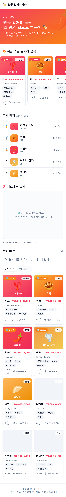
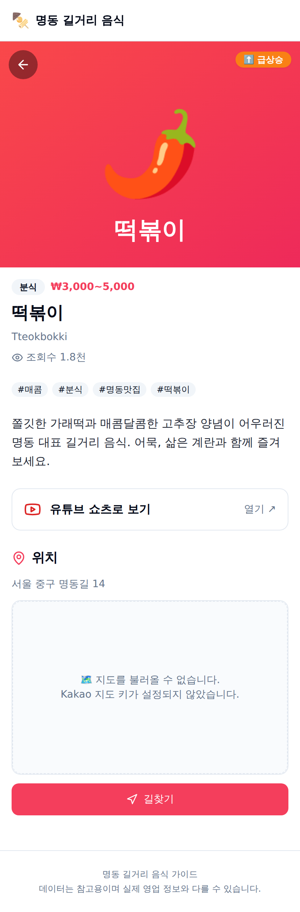
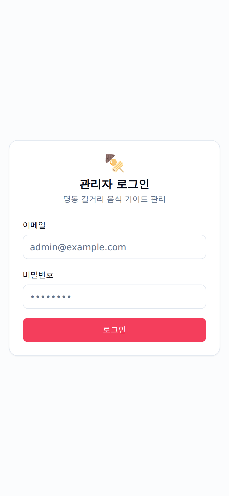

# 명동 길거리 음식 가이드 (Myeongdong Street Food Guide)

명동의 인기 길거리 음식을 지도와 함께 한눈에 볼 수 있는 모바일 우선 웹
서비스입니다. 트렌딩/랭킹, 검색·정렬, 카카오 지도, 길찾기, 관리자 CRUD를
제공합니다.

## 스크린샷

> 데모 모드(`NEXT_PUBLIC_DEMO_MODE=1`)로 렌더링한 모바일 화면입니다. 지도는
> Kakao 키 설정 시 표시됩니다.

| 홈 (트렌딩·랭킹·탐색) | 음식 상세 | 관리자 로그인 |
| :---: | :---: | :---: |
|  |  |  |

## 기술 스택

- **Next.js 14** (App Router) + **TypeScript**
- **Tailwind CSS** + **shadcn/ui**
- **Supabase** (Postgres + Auth + Storage)
- **Kakao Maps** JavaScript SDK
- **Vitest** (unit) + **Playwright** (e2e)
- 배포: **Vercel**

## 주요 기능

- 🔥 트렌딩 섹션 (HOT / 급상승 배지) + 주간 랭킹 (조회수 TOP 5)
- 인기순/최신순 정렬 토글, 이름·해시태그·카테고리 검색
- 음식 카드: 썸네일, 이름, 카테고리, 가격대, 해시태그 칩, 조회수
- 카카오 지도(전체 마커 / 단일 마커) + 마커 클릭 시 상세 이동 + **길찾기** 딥링크
- 상세 페이지 방문 시 조회수 증가 (API Route → SQL 함수)
- 유튜브 쇼츠 **외부 링크** (임베드 스트리밍 없음)
- 관리자: 이메일/비밀번호 로그인, 음식 CRUD(서버 액션), 썸네일 Storage 업로드,
  급상승 토글

## 프로젝트 구조

```
app/
  (public)/            # 공개 페이지
    page.tsx           # 홈 (히어로/트렌딩/랭킹/지도/탐색)
    food/[id]/page.tsx # 음식 상세
  (admin)/admin/       # 관리자 (미들웨어로 보호)
    login/             # 로그인
    page.tsx           # 대시보드
    foods/new          # 생성
    foods/[id]/edit    # 수정
    actions.ts         # 서버 액션 (CRUD/auth)
  api/foods/[id]/view  # 조회수 증가 API
components/            # UI / 도메인 컴포넌트 (KakaoMap 등)
lib/supabase/          # 브라우저/서버/미들웨어 클라이언트
lib/                   # 타입, 정렬/검색 유틸, 지도 유틸, 쿼리
supabase/migrations/   # 0001_init.sql
supabase/seed.sql      # 시드 8종
tests/                 # vitest(unit) / playwright(e2e)
```

## 1. 사전 준비

- Node.js 20+
- [Supabase](https://supabase.com) 프로젝트
- [Kakao Developers](https://developers.kakao.com) 앱 (JavaScript 키)

## 2. 환경 변수

`.env.local.example` 를 복사해 `.env.local` 을 만들고 값을 채웁니다.

```bash
cp .env.local.example .env.local
```

| 변수 | 설명 |
| --- | --- |
| `NEXT_PUBLIC_SUPABASE_URL` | Supabase 프로젝트 URL |
| `NEXT_PUBLIC_SUPABASE_ANON_KEY` | Supabase anon public 키 |
| `SUPABASE_SERVICE_ROLE_KEY` | 서버 전용 service role 키 (브라우저 노출 금지) |
| `NEXT_PUBLIC_KAKAO_MAP_KEY` | Kakao JavaScript 키 |
| `NEXT_PUBLIC_SUPABASE_STORAGE_BUCKET` | 썸네일 버킷명 (기본 `food-thumbnails`) |
| `NEXT_PUBLIC_DEMO_MODE` | (선택) `1` 이면 Supabase 미설정 시 샘플 데이터 표시 |

Supabase 키는 **Project Settings → API**, Kakao 키는 **내 애플리케이션 →
앱 키 → JavaScript 키** 에서 확인합니다. Kakao 콘솔의 **플랫폼 → Web** 에
사용 도메인(예: `http://localhost:3000`, 배포 도메인)을 등록해야 지도가
로드됩니다.

## 3. 데이터베이스 마이그레이션 & 시드

### 방법 A — Supabase SQL Editor (가장 간단)

1. Supabase 대시보드 → **SQL Editor**
2. `supabase/migrations/0001_init.sql` 내용을 붙여넣고 실행
3. `supabase/seed.sql` 내용을 붙여넣고 실행

### 방법 B — Supabase CLI

```bash
npm i -g supabase
supabase link --project-ref <your-project-ref>
supabase db push                               # 마이그레이션 적용
supabase db execute --file supabase/seed.sql   # 시드
```

마이그레이션은 다음을 생성합니다:

- `foods` 테이블 + 인덱스
- RLS 정책: 누구나 SELECT, 인증 사용자만 INSERT/UPDATE/DELETE
- `increment_view_count(food_id uuid)` 함수 (조회수 증가)
- `food-thumbnails` Storage 버킷 + 정책

## 4. 관리자 계정 생성

Supabase 대시보드 → **Authentication → Users → Add user** 에서
이메일/비밀번호 사용자를 만든 뒤, 그 정보로 `/admin/login` 에 로그인합니다.
(가입 페이지는 제공하지 않습니다 — 운영자 계정은 콘솔에서 생성)

## 5. 로컬 개발

```bash
npm install
npm run dev
# http://localhost:3000        공개 사이트
# http://localhost:3000/admin  관리자
```

## 6. 스크립트

```bash
npm run dev        # 개발 서버
npm run build      # 프로덕션 빌드
npm run start      # 프로덕션 서버
npm run lint       # ESLint
npm run typecheck  # tsc --noEmit
npm run test       # Vitest (단위 테스트)
npm run test:e2e   # Playwright (e2e, 빌드 후 자동 서버 기동)
```

> 빌드/단위 테스트/린트는 실제 Supabase 키 없이도 통과하도록 설계되어 있습니다
> (키가 없으면 데이터 조회가 빈 목록으로 안전하게 폴백).

## 7. CI

`.github/workflows/ci.yml` 가 push/PR 마다 lint → typecheck → vitest →
playwright 를 실행합니다. 비밀 값이 없으면 placeholder 환경 변수로
빌드/실행합니다. 실제 값을 쓰려면 리포지토리 **Settings → Secrets** 에
`NEXT_PUBLIC_SUPABASE_URL`, `NEXT_PUBLIC_SUPABASE_ANON_KEY`,
`NEXT_PUBLIC_KAKAO_MAP_KEY` 를 등록하세요.

## 8. Vercel 배포

1. GitHub 리포지토리를 Vercel 에 import
2. **Environment Variables** 에 `.env.local` 의 모든 변수를 등록
3. (Kakao) 콘솔의 Web 플랫폼에 Vercel 도메인 추가
4. Deploy — 프레임워크는 자동으로 Next.js 로 감지됩니다 (`vercel.json` 포함,
   리전 `icn1`).

## 보안 메모

- 하드코딩된 비밀 값 없음 — 모든 키는 환경 변수로 주입됩니다.
- `SUPABASE_SERVICE_ROLE_KEY` 는 서버에서만 사용되며 클라이언트 번들에
  포함되지 않습니다.
- 조회수 증가는 `SECURITY DEFINER` SQL 함수로 처리해 익명 사용자가 테이블
  UPDATE 권한 없이 카운터만 올릴 수 있습니다.
