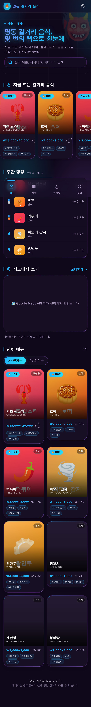

# 명동 길거리 음식 가이드 (Myeongdong Street Food Guide)

명동의 인기 길거리 음식을 지도와 함께 한눈에 볼 수 있는 모바일 우선 웹
서비스입니다. 트렌딩/랭킹, 검색·정렬, Google 지도, 길찾기, 다국어(i18n),
라이트/다크 모드, 로그인 없는 **좋아요**, 검색어 수집, 그리고 비밀번호로 보호되는
**관리자 CRUD**를 제공합니다.

> 스택: **Next.js + Neon(Postgres) + Cloudflare R2(이미지) + 비밀번호 쿠키 인증**

## 🚀 샘플 바로 배포 (Vercel, 설정 0)

`DATABASE_URL` 등 환경 변수가 **없으면** 내장 **데모 데이터**(명동 길거리 음식
8종)로 자동 렌더링되어 화면을 즉시 확인할 수 있습니다. 지도는
`NEXT_PUBLIC_GOOGLE_MAPS_API_KEY`, 실제 데이터/관리자는 아래
[환경 변수](#2-환경-변수)를 추가하면 활성화됩니다.

## 스크린샷

> 데모 모드(`NEXT_PUBLIC_DEMO_MODE=1`)로 렌더링한 모바일 화면입니다.

| 홈 | 검색 | 트렌딩 |
| :---: | :---: | :---: |
|  |  |  |

| 음식 상세 | 화면 설정 (언어) | 테마 전환 |
| :---: | :---: | :---: |
|  |  |  |

## 기술 스택

- **Next.js 14** (App Router) + **TypeScript**
- **Tailwind CSS** + **framer-motion** + Radix 프리미티브 (모노크롬 디자인)
- **Neon Postgres** — `@neondatabase/serverless` 드라이버로 직접 SQL
- **Cloudflare R2** — 썸네일 이미지 저장(`aws4fetch`), DB엔 URL만
- **관리자 인증** — 비밀번호 + 서명된 HttpOnly 쿠키 (Web Crypto HMAC, 외부 서비스 X)
- **Google Maps** (`@react-google-maps/api`)
- **next-intl** (ko / en / ja / es 다국어)
- **Vitest** (unit) + **Playwright** (e2e)
- 배포: **Vercel** (다른 호스팅도 동작)

## 주요 기능

- 🔍 **검색** — 이름·해시태그·카테고리 즉시 검색(디바운스), 매칭어 하이라이트.
  검색어는 익명 집계되어 관리자 통계에 표시됩니다.
- ❤️ **좋아요(로그인 없음)** — IP당 1회(DB UNIQUE) + localStorage 중복 방지 +
  rate limit. 낙관적 UI로 즉시 반영.
- 📈 **조회수 / 통계** — 상세 방문 시 조회수 집계(6시간 디바이스 중복 방지),
  `/admin/analytics`에서 인기 검색어·결과 없는 검색어·조회/좋아요 TOP 확인.
- 🌏 **다국어(i18n)** — 한국어·영어·일본어·스페인어 4개 로케일, 브라우저 언어 감지.
- 🗺 **Google 지도** — 다중/단일 마커, 마커 클릭 상세 이동, **길찾기** 딥링크.
- 📱 **모바일 하단 내비** — 홈 / 지도 / 트렌딩 / 검색.
- 🛠 **관리자** — 비밀번호 로그인, 음식 CRUD(다국어 필드), **R2 이미지 업로드**,
  급상승 토글.
- 🔒 **남용 방지** — 동일 출처(CORS) 가드, IP별 rate limit, IP 해시(원본 미저장).

## 프로젝트 구조

```
app/
  (public)/            # 공개 페이지 (헤더 + 하단 내비)
    page.tsx           # 홈 (Threads 스타일 피드)
    search/  trending/  map/  food/[id]/
  (admin)/admin/       # 관리자 (미들웨어 쿠키 세션으로 보호) + analytics
  api/foods/[id]/view  # 조회수 증가
  api/foods/[id]/like  # 좋아요 토글 (IP 중복 방지)
  api/search/log       # 검색어 수집
  robots.ts  sitemap.ts
components/            # FoodPost, FoodCard, SearchView, LikeButton, GoogleMap ...
i18n/                  # next-intl 설정
messages/              # ko / en / ja / es
lib/
  db.ts                # Neon sql 클라이언트
  session.ts auth.ts   # 비밀번호 + 서명 쿠키 인증
  storage.ts           # Cloudflare R2 업로드
  ip.ts rate-limit.ts request-guard.ts   # 남용 방지
  queries.ts demo-data.ts sort.ts ...
db/                    # schema.sql + seed.sql (Neon Postgres)
tests/                 # vitest(unit) / playwright(e2e)
```

## 1. 사전 준비

- Node.js 20+ (CI는 22)
- [Neon](https://neon.tech) 프로젝트 (Postgres)
- [Cloudflare R2](https://developers.cloudflare.com/r2/) 버킷 (이미지 업로드용, 선택)
- [Google Cloud Console](https://console.cloud.google.com) — Maps JavaScript API 키 (선택)

## 2. 환경 변수

`.env.local.example` 를 복사해 `.env.local` 을 만들고 값을 채웁니다.

```bash
cp .env.local.example .env.local
```

| 변수 | 설명 |
| --- | --- |
| `DATABASE_URL` | Neon Postgres 연결 문자열 (없으면 데모 데이터) |
| `ADMIN_PASSWORD` | 관리자 비밀번호 (또는 `ADMIN_PASSWORD_HASH` = sha256 hex) |
| `SESSION_SECRET` | 세션 쿠키 서명용 랜덤 문자열 (`openssl rand -hex 32`) |
| `IP_HASH_SALT` | 좋아요 IP 해시용 비밀값 (원본 IP는 저장 안 함) |
| `NEXT_PUBLIC_SITE_URL` | 공개 도메인 (robots/sitemap·동일 출처 허용) |
| `R2_ACCOUNT_ID` 외 | R2 이미지 업로드용 (`R2_ACCESS_KEY_ID`, `R2_SECRET_ACCESS_KEY`, `R2_BUCKET`, `R2_PUBLIC_BASE_URL`) |
| `NEXT_PUBLIC_GOOGLE_MAPS_API_KEY` | Google Maps 키 (선택) |
| `UPSTASH_REDIS_REST_URL` / `_TOKEN` | (선택) 분산 rate limit |
| `NEXT_PUBLIC_DEMO_MODE` | (선택) `1` 이면 DB가 있어도 데모 데이터 강제 |

> `DATABASE_URL` 이 **없으면 자동으로 데모 데이터**가 표시됩니다(설정 0 배포용).

## 3. 데이터베이스 (Neon)

Neon 콘솔에서 프로젝트를 만들고 스키마/시드를 적용합니다.

```bash
psql "$DATABASE_URL" -f db/schema.sql     # 테이블 + 함수
psql "$DATABASE_URL" -f db/seed.sql       # (선택) 샘플 8종
```

`db/schema.sql` 는 `foods` / `food_likes` / `search_events` 테이블과
`increment_view_count` · `toggle_like` · `log_search` 함수를 만듭니다. RLS·역할은
없으며, 모든 DB 접근은 서버에서 `DATABASE_URL` 한 역할로만 일어납니다.

## 4. 다국어(i18n)

- **UI 문구**: `messages/{ko,en,ja,es}.json`. next-intl 쿠키 기반(URL 비변경),
  첫 방문 시 `Accept-Language` 자동 감지(기본 `ko`), 이후 `NEXT_LOCALE` 쿠키 저장.
- **음식 데이터**: 이름은 `name_ko/en/ja/es` 컬럼, 설명은 `translations` JSONB.
  누락 시 영어 → 한국어로 폴백(`lib/i18n-food.ts`).

## 5. 테마 시스템

액센트/모드는 `localStorage`(`md.accent`, `md.mode`)에 저장되어 `<html>` 속성으로
적용되며, 색상은 CSS 변수(`app/globals.css`)로 정의됩니다. `<head>` 인라인
스크립트가 첫 페인트 전에 적용해 FOUC를 방지합니다.

## 6. 관리자 로그인

`ADMIN_PASSWORD`(또는 `ADMIN_PASSWORD_HASH`)와 `SESSION_SECRET`을 설정한 뒤
`/admin/login` 에서 **비밀번호**로 로그인합니다. 비밀번호를 모르면 아무도 접근할 수
없습니다. (백오피스 UI 문구는 한국어 고정.)

## 7. 로컬 개발 & 스크립트

```bash
npm install
npm run dev        # 개발 서버 (http://localhost:3000)
npm run build      # 프로덕션 빌드
npm run start      # 프로덕션 서버
npm run lint       # ESLint
npm run typecheck  # tsc --noEmit
npm run test       # Vitest (단위 테스트)
npm run test:e2e   # Playwright (e2e)
```

> 빌드/단위 테스트/린트는 실제 DB·키 없이도 통과합니다(데모 데이터/안내
> 플레이스홀더로 폴백). 관리자 로그인 e2e는 `ADMIN_PASSWORD`가 있을 때만 실행됩니다.

## 8. 배포

Vercel에 import → 환경 변수 등록 → Deploy. 자세한 단계와 보안 요약은
**[DEPLOY.md](./DEPLOY.md)** 를 참고하세요.

## 보안 메모

- 하드코딩된 비밀 값 없음 — 모든 키는 환경 변수로 주입.
- 관리자: 비밀번호 + 서명 쿠키(미들웨어 + 레이아웃 + 서버액션 3중 게이트), `noindex`,
  robots `Disallow`.
- 좋아요/조회/검색 API: 동일 출처 가드 + IP rate limit + UUID 검증 + 일반화된 오류.
- 개인정보: 원본 IP 저장 안 함 — `sha256(IP + IP_HASH_SALT)` 만 저장.
